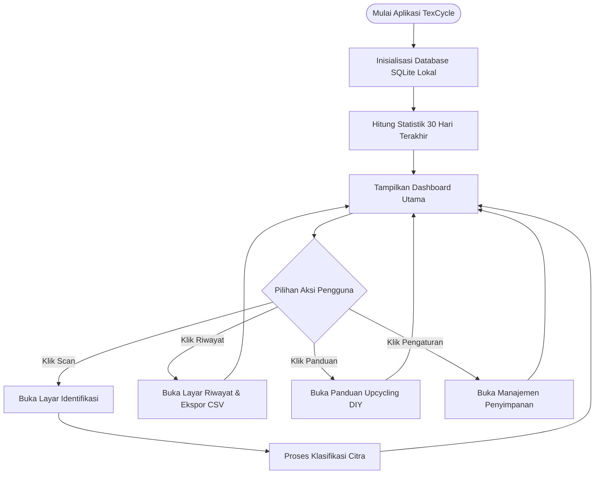
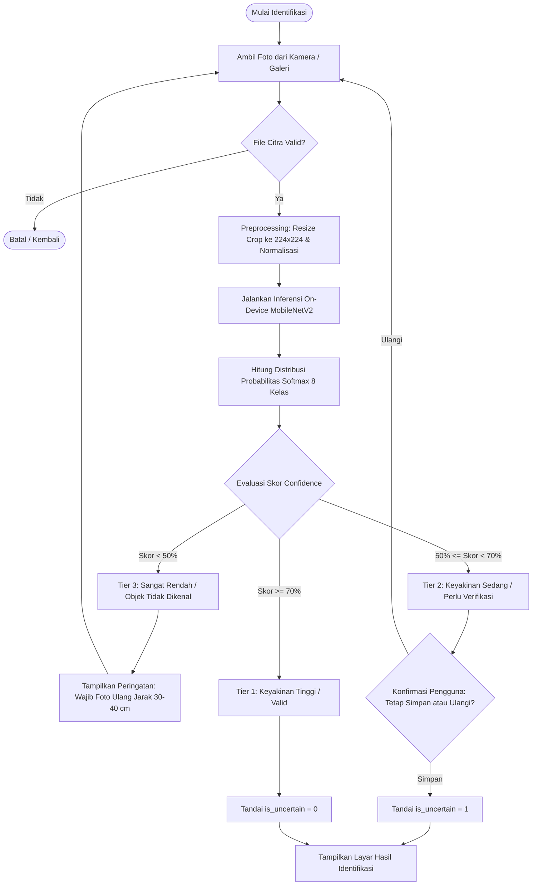
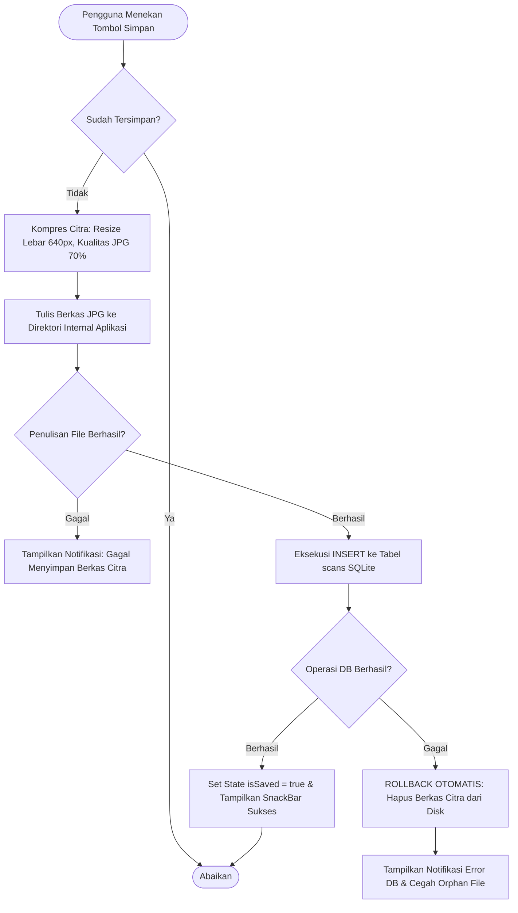

# DOKUMENTASI LENGKAP APLIKASI TEXCYCLE
## Sistem Identifikasi & Tata Kelola Limbah Tekstil Industri Berskala Mikro Berbasis On-Device Machine Learning (100% Offline)

---

## 1. IDENTITAS & KONSEP APLIKASI

### 1.1 Profil Umum
* **Nama Aplikasi**: **TexCycle** *(Textile + Cycle)*
* **Tagline**: *"Identifikasi Cerdas, Pengurangan Limbah, dan Penciptaan Nilai untuk Konveksi Mikro"*
* **Versi**: 1.2 (Advance Production Release)
* **Kategori / Sub-Tema**: *Waste Reduction & Circular Economy*
* **Platform Target**: Android (Mobile) & Cross-Platform Web (Google Chrome)
* **Arsitektur Utama**: **100% On-Device / Edge Computing** (Mandiri, tanpa ketergantungan server cloud/API eksternal)

### 1.2 Latar Belakang & Urgensi
Industri konveksi skala mikro (1–10 tenaga kerja) menghasilkan limbah kain perca, sisa benang, dan sisa bahan kimia dalam jumlah signifikan setiap harinya. Sebagian besar UMKM belum memiliki pemahaman klasifikasi limbah yang memadai:
1. **Limbah Non-B3 yang Bernilai Ekonomi** (kain perca besar, sedang, kecil) sering dibakar atau dibuang ke TPA, padahal memiliki nilai jual ke pengepul atau dapat diolah menjadi produk bernilai tambah (*upcycling*).
2. **Limbah B3 (Bahan Berbahaya dan Beracun)** seperti air sisa pewarnaan kimia, sludge endapan IPAL, dan kain majun berminyak berisiko dibuang langsung ke saluran air warga karena ketidaktahuan prosedur legal Dinas Lingkungan Hidup (DLH).

### 1.3 Filosofi Desain Antarmuka
TexCycle mengusung prinsip antarmuka **Minimalis, Fungsional, dan Bebas Emotikon Berlebihan**:
* Mengganti deretan emoji bertaburan gaya chatbot AI dengan **Ikonografi Standar Material Design** (`Icons.analytics_outlined`, `Icons.inventory_2_outlined`, `Icons.warning_amber_rounded`).
* Menggunakan tipografi formal berbahasa Indonesia baku yang sesuai untuk laporan teknis, standar operasional industri, dan penulisan karya ilmiah/paper penelitian.
* Skema warna berakar pada prinsip keberlanjutan lingkungan: *Forest Green* (`#1B5E20`) sebagai representasi kelestarian, *Alert Red* (`#C62828`) untuk penanda bahaya B3, dan *Warm Amber* (`#FFA000`) sebagai peringatan verifikasi.

---

## 2. DESAIN TAMPILAN, STRUKTUR HALAMAN, & RINCIAN FITUR SISTEM

Aplikasi **TexCycle Versi 1.2** dirancang dengan arsitektur navigasi datar (*flat navigation*) yang terdiri dari 7 layar operasional utama. Setiap halaman dirancang ergonomis untuk mendukung kemudahan dan kecepatan kerja pengrajin di lantai produksi konveksi:

---

### 2.1 Layar 1: Layar Pembuka & Async Preloader (`SplashView`)
* **Komponen Tampilan (Ada Apa Saja):**
  - Lencana sirkular eco-green berhiaskan ikon daur ulang dan daun hijau segar.
  - Judul aplikasi *TexCycle* dan subjudul *Platform Tata Kelola & Daur Ulang Tekstil*.
  - Linear progress bar dinamis berefek pendaran hijau neon (`greenAccent`).
  - Teks status tahapan proses inisialisasi asinkron yang berjalan di latar belakang.
  - Label versi rilis: *Versi 1.2 • 100% On-Device Engine*.
* **Fitur Teknis (Fitur Apa Saja):**
  - **Inisialisasi Paralel Asinkron**: Memuat koneksi basis data SQLite, memanaskan bobot model AI MobileNetV2 ke memori RAM, dan mengalibrasi kesiapan modul sensor kamera secara bersamaan.
  - **Eliminasi Layar Putih (Zero White Screen Freeze)**: Menghilangkan jeda tampilan kosong saat pertama kali membuka aplikasi.
  - **Transisi Halus (Fade Transition)**: Memastikan animasi minimum 900 ms agar pergantian ke beranda nyaman di mata.
* **Alur & Cara Kerja (Bagaimana Cara Kerjanya):**
  Pengguna mengetuk ikon TexCycle di menu smartphone. Dalam waktu < 100 ms, SplashView langsung muncul. Di latar belakang, sistem mengecek integritas file dan memanaskan mesin inferensi. Progress bar bergerak mulus hingga 100%, lalu secara otomatis berpindah ke halaman beranda utama (`HomeView`).

---

### 2.2 Layar 2: Beranda & Dashboard Monitoring (`HomeView`)
* **Komponen Tampilan (Ada Apa Saja):**
  - Header informasi pengguna beserta status *100% On-Device • Mode Offline Aktif*.
  - Kartu Statistik 30 Hari: Total frekuensi pemindaian, persentase limbah Non-B3 (Aman/Hijau), persentase limbah B3 (Bahaya/Merah), dan bar visual proporsi.
  - Banner Peringatan Dini B3: Otomatis muncul jika dalam 7 hari terakhir terdeteksi limbah berbahaya (B3/Sludge).
  - Tombol Aksi Utama (*Hero CTA*) berukuran besar: *"Identifikasi Limbah Sekarang"*.
  - Tiga kartu navigasi cepat menuju Riwayat Scan, Panduan Upcycling DIY, dan Pengaturan Memori.
* **Fitur Teknis (Fitur Apa Saja):**
  - **Agregasi Data Real-Time**: Menghitung statistik pemindaian langsung dari database SQLite lokal tanpa server internet.
  - **Proteksi Anti-Overflow**: Membungkus baris statistik menggunakan `FittedBox` dan `Expanded` agar teks tidak pernah terpotong garis kuning-hitam.
  - **Peringatan Dini Lingkungan**: Pengingat berkala otomatis untuk mencegah kelalaian pembuangan limbah beracun.
* **Alur & Cara Kerja (Bagaimana Cara Kerjanya):**
  Pengguna membuka aplikasi dan langsung melihat rekapitulasi limbah produksinya selama 30 hari terakhir. Jika ada potongan kain baru atau sisa bahan pewarna yang perlu dipilah, pengguna cukup mengetuk tombol hijau besar "Identifikasi Limbah" untuk langsung mengaktifkan kamera pemindai.

---

### 2.3 Layar 3: Kamera Cerdas & Advance Lens HUD (`ScanView`)
* **Komponen Tampilan (Ada Apa Saja):**
  - Bidang bidik kamera langsung (*Live In-App Viewfinder*) bersudut membulat modern.
  - Banner Sensor Real-Time di bilah atas pemotretan.
  - Reticle lingkaran fokus dinamis di tengah bidikan (berubah warna: Hijau = Optimal, Kuning = Menstabilkan/Redup, Merah = Sangat Gelap).
  - Animasi laser scanning bar hijau neon yang bergerak naik-turun.
  - Live HUD Lux Meter badge (menampilkan persentase kecerahan cahaya visual `Lux: XX%`).
  - Tombol Pintas 1-Tap Auto-Flash (muncul otomatis saat sensor mendeteksi ruangan gelap).
  - Kendali Zoom Digital (tombol toggle `1x` dan `2x`).
  - Tombol Shutter utama melingkar berdiameter 76 px dengan pendaran cahaya.
  - Tombol alternatif: Pengambilan foto dari Galeri Penyimpanan dan Kamera Bawaan HP.
* **Fitur Teknis (Fitur Apa Saja):**
  - **Real-Time Y-Channel Luminance Sensing**: Mengukur intensitas cahaya rata-rata pada kanal Y setiap 250 ms (< 1% beban CPU).
  - **Deteksi Guncangan (Motion Jitter Detection)**: Menganalisis variasi intensitas antar frame untuk mencegah hasil potret buram.
  - **Kontrol Lampu Kilat (Torch Mode)**: Menyalakan senter HP secara stabil untuk penerangan kain di ruangan minim cahaya.
  - **Proteksi Tombol Kembali Fisik (`PopScope`)**: Mencegah proses inferensi AI terhenti tiba-tiba saat tombol Back Android ditekan.
* **Alur & Cara Kerja (Bagaimana Cara Kerjanya):**
  Pengguna meletakkan potongan kain pada jarak 30–40 cm di atas latar polos. Lensa kamera langsung membaca tingkat cahaya secara real-time. Jika pencahayaan kurang (< 42 Lux), banner menampilkan peringatan merah dan tombol chip "Nyalakan Flash" otomatis muncul. Saat tangan pengguna stabil dan lingkaran bidik berubah hijau, pengguna menekan tombol shutter. Citra seketika dipotret dan diproses oleh AI on-device dalam ~68 ms.

---

### 2.4 Layar 4: Hasil Identifikasi & Rekomendasi Kreasi DIY (`ResultView`)
* **Komponen Tampilan (Ada Apa Saja):**
  - Foto limbah hasil pemotretan dengan optimasi memori (`cacheWidth: 800`).
  - Badge Kategori Tegas: Hijau (*Kategori Non-B3*) atau Merah (*Kategori B3 Beracun*).
  - Angka persentase keyakinan model (% Confidence).
  - Kartu Rekomendasi & Estimasi Nilai Jual ke pengepul bahan baku (Rp/kg).
  - **Modul Seamless Kreasi Proyek DIY** (khusus Non-B3): Menampilkan ide kerajinan daur ulang (Tote Bag, Pouch, Scrunchie, dsb.) lengkap dengan durasi, tingkat kesulitan, daftar alat & bahan, serta langkah-langkah pembuatan langsung di layar yang sama.
  - Kotak 5 Prosedur Standar Wajib DLH (khusus B3 beracun).
  - Formulir input catatan berat limbah (kg) atau nomor rol kain.
  - Tombol Aksi: *"Simpan Ke Riwayat"* dan *"Scan Limbah Lain"*.
* **Fitur Teknis (Fitur Apa Saja):**
  - **Sistem Validasi 3-Tier**: Tier 1 (Valid $\ge 70\%$ langsung tampil), Tier 2 (Akurasi sedang 50–70% dengan dialog konfirmasi), dan Tier 3 (Tolak $< 50\%$ wajib foto ulang).
  - **Integrasi Seamless DIY**: Menghilangkan friksi pengguna berpindah menu secara manual.
  - **Penyimpanan Atomik Database**: Menyimpan foto dan rekaman SQLite secara atomik dengan rollback otomatis jika memori penuh.
* **Alur & Cara Kerja (Bagaimana Cara Kerjanya):**
  Setelah foto diproses, hasil diagnosis jenis limbah langsung muncul. Jika limbah teridentifikasi sebagai kain perca besar, aplikasi menyarankan pembuatan Tote Bag belanja dan mencantumkan taksiran harga jual per kilogram. Pengguna dapat langsung membaca instruksi pembuatan produk, mengetikkan estimasi bobot sisa kain (misal: 2.5 kg), lalu menekan tombol "Simpan Ke Riwayat".

---

### 2.5 Layar 5: Riwayat Identifikasi & Ekspor Laporan (`HistoryView`)
* **Komponen Tampilan (Ada Apa Saja):**
  - Kolom formulir pencarian teks real-time.
  - Bilah Filter Choice Chips: *Semua*, *Non-B3*, *Limbah B3*, *Perlu Verifikasi*.
  - Shimmer Skeleton Loading: Animasi kartu placeholder abu-abu saat membaca basis data.
  - Daftar kartu riwayat: Thumbnail foto beresolusi teroptimasi (`cacheWidth: 150`), nama jenis limbah, tanggal & jam scan, persentase akurasi, dan catatan berat.
  - Modal Bottom Sheet Detail: Lembar informasi resolusi penuh saat kartu ditekan beserta tombol hapus.
  - Tombol Ekspor CSV Laporan (Excel) di bagian bawah layar.
* **Fitur Teknis (Fitur Apa Saja):**
  - **Pencarian Teks Instan (Instant Search)**: Memfilter nama jenis limbah dan catatan pengguna secara langsung saat mengetik.
  - **Thumbnail Hemat Memori (~90 KB per foto)**: Menggunakan downsampling memori untuk menjamin *Zero Memory Leak* meskipun ada ratusan data.
  - **Ekspor CSV & Share Intent**: Menghasilkan tabel CSV yang kompatibel dengan Microsoft Excel dan tombol berbagi langsung ke WhatsApp atau Email.
* **Alur & Cara Kerja (Bagaimana Cara Kerjanya):**
  Pengguna membuka riwayat untuk memantau rekapitulasi limbah mingguan. Pengguna dapat mencari kata kunci tertentu (misal: "katun") atau memfilter hanya limbah B3. Saat salah satu kartu ditekan, lembar detail interaktif terbuka menampilkan foto besar dan SOP penanganannya. Pengguna dapat menekan tombol "Ekspor CSV" untuk mengirimkan berkas laporan kepada dinas lingkungan hidup atau mitra pengepul daur ulang.

---

### 2.6 Layar 6: Panduan Upcycling & Kerajinan DIY (`GuideView`)
* **Komponen Tampilan (Ada Apa Saja):**
  - Deretan pilihan chip kategori bahan baku: *Semua*, *Kain Besar*, *Kain Sedang*, *Kain Kecil*, *Sisa Benang*, *Kemasan*.
  - Katalog kartu proyek tutorial kerajinan tangan interaktif (Tote Bag, Pouch Kosmetik, Masker Kain, Bros Hijab Bunga Perca, Rumbai Etnik, Wadah Pensil Meja).
  - Badge durasi pengerjaan (menit/jam) dan tingkat kesulitan (Mudah/Menengah).
  - Accordion dropdown daftar Alat & Bahan serta Langkah-Langkah Pembuatan berurutan nomor.
* **Fitur Teknis (Fitur Apa Saja):**
  - **Katalog Terpusat `DIYData`**: Data panduan tersimpan permanen di aplikasi sehingga dapat diakses 100% offline tanpa kuota.
  - **Filter Kategori Dinamis**: Mengelompokkan proyek berdasarkan ukuran potongan kain yang dimiliki pengguna.
* **Alur & Cara Kerja (Bagaimana Cara Kerjanya):**
  Pengguna yang memiliki stok sisa potongan kain kecil membuka panduan ini, memilih filter "Kain Kecil", lalu memilih tutorial "Bros Hijab Bunga Perca". Pengguna melihat alat dan bahan yang dibutuhkan (gunting, peniti bros, lem tembak), kemudian mengikuti panduan langkah demi langkah hingga produk siap dipasarkan.

---

### 2.7 Layar 7: Pengaturan & Diagnostik Memori (`SettingsView`)
* **Komponen Tampilan (Ada Apa Saja):**
  - **Kartu Pilihan Bahasa Bilingual**: Pemilih tombol segmen (`ID` / `EN`) untuk beralih instan antara **Bahasa Indonesia** dan **English (US)** secara ringkas, alami, dan bebas teks berlebih (*Zero Text Bloat*).
  - Kartu Profil Aplikasi *TexCycle v1.2 Advance Lens Edition*.
  - Panel Diagnostik Ruang Penyimpanan Nyata: Menampilkan ukuran data SQLite dan folder foto (dalam satuan MB).
  - Tombol Pemeliharaan: *"Ekspor Riwayat ke CSV"*, *"Hapus Riwayat > 6 Bulan"*, dan *"Reset Data Riwayat"*.
  - Panel Informasi Profil Keamanan, Lisensi, dan Mode 100% Offline.
* **Fitur Teknis (Fitur Apa Saja):**
  - **Arsitektur Lokalisasi Reaktif (`AppLocale` & `AppText`)**: Pengalihan bahasa 1-tap yang langsung memperbarui seluruh UI secara global tanpa perlu merestart aplikasi. Teks dirancang ringkas (1–4 kata per aksi) untuk mencegah *text-overflow*.
  - **Kalkulasi Ruang Simpan Real-Time**: Menghitung ukuran memori internal HP yang digunakan secara nyata melalui `path_provider`.
  - **Pembersihan Cache Aman**: Menghapus file cache gambar sementara tanpa merusak catatan penting di database SQLite.
* **Alur & Cara Kerja (Bagaimana Cara Kerjanya):**
  Pengguna masuk ke menu pengaturan untuk mengganti bahasa aplikasi ke English (US) atau kembali ke Bahasa Indonesia cukup dengan menyentuh tombol toggle `ID` / `EN`. Seluruh menu aplikasi seketika berganti bahasa. Pengguna juga dapat memeriksa berapa megabyte ruang penyimpanan HP yang terpakai dan mengekspor laporan manifest CSV.

---

## 3. SPESIFIKASI FITUR SISTEM

| No | Modul Fitur | Deskripsi Fungsional | Keunggulan Teknis |
|---|---|---|---|
| **F-01** | **On-Device Vision Classifier** | Klasifikasi citra limbah tekstil ke dalam 8 kategori secara offline. | Berjalan via `tflite_flutter` (C++ JNI native) tanpa koneksi internet. |
| **F-02** | **3-Tier Confidence Validation** | Validasi tingkat kepastian hasil AI ke 3 tingkatan (Tinggi, Sedang/Verifikasi, Rendah/Tolak). | Menghindari misklasifikasi fatal limbah berbahaya. |
| **F-03** | **Kepatuhan Regulasi DLH (B3)** | Panduan 5 Prosedur Wajib DLH otomatis saat terdeteksi limbah berbahaya. | Mencegah sanksi pidana lingkungan bagi UMKM. |
| **F-04** | **Valuasi & Upcycling Non-B3** | Panduan pemanfaatan kembali dan taksiran harga jual per kilogram. | Membuka peluang pendapatan sampingan dari sisa potongan kain. |
| **F-05** | **Kompresi Citra Otomatis** | Citra kamera otomatis dikompresi ke 640px dengan kualitas JPG 70%. | Ukuran file terpangkas dari ~4 MB menjadi ~50 KB (hemat 98.7% memori). |
| **F-06** | **Advance Lens HUD Sensing** | Evaluasi pencahayaan real-time & deteksi goyangan kamera. | Sampling Y-Luminance 4 FPS pada CPU < 1%. |
| **F-07** | **Penyimpanan Lokal Atomik** | Database SQLite relasional dengan integritas rollback otomatis. | Bebas file sampah yatim (zero orphan files). |
| **F-08** | **Katalog DIY Offline** | Repositori tutorial kerajinan kain perca siap saji. | Akses 100% tanpa kuota internet. |
| **F-09** | **Ekspor Manifest CSV** | Generate tabel rekapitulasi limbah berformat Excel. | Kompatibel dengan sistem pelaporan DLH. |
| **F-10** | **Bilingual Multi-Language (ID & EN)** | Pilihan bahasa Indonesia & English US alami, ringkas, dan bebas text-bloat. | Reaktif seketika tanpa restart via `AppLocale`. |

---

## 4. FLOWCHART SISTEM (SKEMA ALUR LENGKAP)

> 🖼️ **Berkas Gambar Jernih Terpisah (Siap Unduh & Cetak)**:
> * 📥 **Format PNG Resolusi Tinggi (2000x1180)**: [`flowchart_aplikasi_texcycle.png`](file:///C:/Users/Dani/TexCycle_Project/diagrams/flowchart_aplikasi_texcycle.png)
> * 📥 **Format Vektor SVG (Skalabilitas Tak Terbatas)**: [`flowchart_aplikasi_texcycle.svg`](file:///C:/Users/Dani/TexCycle_Project/diagrams/flowchart_aplikasi_texcycle.svg)

### 4.1 Flowchart Level 0: Siklus Hidup Aplikasi Utama



### 4.2 Flowchart Level 1: Inferensi AI On-Device & Validasi 3-Tier



### 4.3 Flowchart Level 2: Kompresi Citra & Atomic Rollback Storage



---

## 5. ARSITEKTUR DATABASE SQLITE
 
> 🖼️ **Berkas Gambar Jernih Terpisah (Siap Unduh & Cetak)**:
> * 📥 **Format PNG Resolusi Tinggi (2000x1180)**: [`skema_database_texcycle.png`](file:///C:/Users/Dani/TexCycle_Project/diagrams/skema_database_texcycle.png)
> * 📥 **Format Vektor SVG (Skalabilitas Tak Terbatas)**: [`skema_database_texcycle.svg`](file:///C:/Users/Dani/TexCycle_Project/diagrams/skema_database_texcycle.svg)

### 5.1 Spesifikasi Database
* **Nama Berkas**: `texcycle.db`
* **Engine**: SQLite 3 (via package `sqflite`)
* **Versi Skema**: 2
* **Penyimpanan**: Internal App Data Directory (Sandboxed / Terproteksi)

### 5.2 Skema Tabel `scans` (Data Definition Language)

```sql
CREATE TABLE scans (
    id INTEGER PRIMARY KEY AUTOINCREMENT,
    image_path TEXT NOT NULL,
    jenis_id TEXT NOT NULL,
    label_nama TEXT NOT NULL,
    kategori_b3 INTEGER NOT NULL,
    confidence REAL NOT NULL,
    is_uncertain INTEGER DEFAULT 0,
    catatan TEXT,
    created_at TEXT NOT NULL
);

-- Indeks Performa untuk Pencarian & Filter Cepat
CREATE INDEX idx_scans_created_at ON scans(created_at);
CREATE INDEX idx_scans_b3 ON scans(kategori_b3);
```

### 5.3 Kamus Data (Data Dictionary)

| Kolom | Tipe Data | Nilai Default | Keterangan |
|---|---|---|---|
| `id` | `INTEGER` | *AUTOINCREMENT* | Kunci utama (*Primary Key*) rekaman identifikasi. |
| `image_path` | `TEXT` | - | Path mutlak berkas citra terkompresi di direktori lokal HP. |
| `jenis_id` | `TEXT` | - | Pengidentifikasi unik jenis limbah (misal: `kain_sedang`, `sludge`). |
| `label_nama` | `TEXT` | - | Nama lengkap deskriptif jenis limbah untuk antarmuka. |
| `kategori_b3` | `INTEGER` | - | Status bahaya lingkungan: `0 = Non-B3 (Aman)`, `1 = B3 (Berbahaya)`. |
| `confidence` | `REAL` | - | Skor probabilitas prediksi model AI (rentang `0.0` sampai `1.0`). |
| `is_uncertain` | `INTEGER` | `0` | Flag keyakinan model: `0 = Akurasi Tinggi (>=70%)`, `1 = Perlu Verifikasi (50%-70%)`. |
| `catatan` | `TEXT` | *NULL* | Catatan bebas pengguna (estimasi bobot, catatan warna, atau asal rol kain). |
| `created_at` | `TEXT` | - | Waktu penyimpanan berformat ISO-8601 (`yyyy-MM-dd HH:mm:ss`). |

---

## 6. PIPELINE PELATIHAN MODEL MACHINE LEARNING (AI)

Pipeline pelatihan model machine learning TexCycle dirancang secara mandiri dan dapat dijalankan langsung di lingkungan komputasi GPU Google Colab melalui notebook [`texcycle_training.ipynb`](file:///C:/Users/Dani/development/flutter/texcycle/texcycle_training.ipynb).

### 6.1 Arsitektur Model: MobileNetV2 Transfer Learning
* **Arsitektur Dasar**: `MobileNetV2` (Pre-trained pada bobot *ImageNet*).
* **Rasional Pemilihan**: MobileNetV2 dirancang khusus untuk inferensi perangkat seluler berdaya rendah (*low-latency & memory-constrained*) melalui modul *Inverted Residual Block* dan *Depthwise Separable Convolution*.
* **Input Tensor**: `(None, 224, 224, 3)` dengan rentang normalisasi piksel `[-1.0, 1.0]`.
* **Lapisan Kustom (Custom Top Layers)**:
  1. `GlobalAveragePooling2D()`: Mereduksi fitur spasial menjadi vektor 1280-dimensi.
  2. `BatchNormalization()`: Menstabilkan distribusi gradien.
  3. `Dropout(0.3)`: Mencegah *overfitting* pada dataset berukuran kecil-menengah.
  4. `Dense(256, activation='relu')`: Ekstraksi relasi fitur spesifik tekstil.
  5. `Dense(8, activation='softmax')`: Distribusi probabilitas atas 8 kelas limbah tekstil.

### 6.2 Definisi 8 Kelas Dataset Limbah Tekstil

| No | Label ID | Nama Kategori | Status Regulasi | Target Ukuran Fisik |
|---|---|---|---|---|
| 1 | `kain_besar` | Kain Perca Ukuran Besar | Non-B3 | Panjang/lebar $> 30\text{ cm}$ |
| 2 | `kain_sedang` | Kain Perca Ukuran Sedang | Non-B3 | Ukuran berkisar antara $10 - 30\text{ cm}$ |
| 3 | `kain_kecil` | Kain Perca Ukuran Kecil | Non-B3 | Ukuran trimming $< 10\text{ cm}$ |
| 4 | `benang` | Sisa Benang & Kelos Jahit | Non-B3 | Serat benang campuran & kelos gulungan |
| 5 | `kemasan` | Kemasan Plastik & Karton | Non-B3 | Silinder karton & plastik pembungkus |
| 6 | `limbah_cair` | Air Limbah Kimia Pewarna | **B3 (Bahaya)** | Cairan warna pekat sisa sablon/celup |
| 7 | `sludge` | Sludge IPAL Endapan Lumpur | **B3 (Bahaya)** | Padatan lumpur basah dasar reaktor IPAL |
| 8 | `majun` | Majun Kain Terkontaminasi | **B3 (Bahaya)** | Kain bekas pelumas oli / cairan solvent |

### 6.3 Teknik Augmentasi Data Citra
Untuk memastikan ketahanan model terhadap variasi kondisi riil ruang produksi konveksi mikro UMKM, diterapkan pipeline augmentasi data:
* **Rotasi Acak**: Rentang $\pm 25^\circ$ untuk simulasi sudut pemotretan yang miring.
* **Horizontal & Vertical Flip**: Merefleksikan variasi orientasi potongan kain perca.
* **Zoom & Scale**: Rentang perbesaran $0.85\times - 1.15\times$ untuk simulasi variasi jarak pemotretan 30–40 cm.
* **Variasi Pencahayaan (Brightness Shift)**: Rentang penyesuaian kecerahan $\pm 20\%$ untuk menyimulasikan lampu konveksi yang redup atau terang.

### 6.4 Parameter & Optimasi Pelatihan
* **Optimizer**: Adam dengan tingkat pembelajaran adaptif (*Learning Rate* $10^{-4}$ pada fase transfer learning dan $10^{-5}$ pada fase fine-tuning).
* **Fungsi Kerugian (Loss Function)**: `categorical_crossentropy`.
* **Strategi Callback**:
  - `EarlyStopping(monitor='val_loss', patience=5, restore_best_weights=True)`: Menghentikan pelatihan otomatis saat model mencapai performa puncak.
  - `ReduceLROnPlateau(monitor='val_loss', factor=0.5, patience=2)`: Memperkecil learning rate secara bertahap untuk konvergensi halus.

### 6.5 Kuantisasi Model ke TensorFlow Lite (`.tflite`)
Model Keras (`.h5`) dikonversi ke format seluler menggunakan `TFLiteConverter`:
* **Metode Kuantisasi**: *Float16 Quantization* / *Dynamic Range Quantization*.
* **Ukuran Model Akhir**: Menyusut dari $\approx 28\text{ MB}$ menjadi hanya **$\approx 8.5\text{ MB}$**.
* **Kecepatan Inferensi On-Device**: $\approx 45 - 90\text{ ms}$ per citra pada prosesor smartphone Android standar, beroperasi penuh secara offline tanpa latensi jaringan internet.

---

## 7. KESIMPULAN & DAMPAK NYATA PADA INDUSTRI KONVEKSI

Pengembangan TexCycle membuktikan bahwa teknologi kecerdasan buatan (*Artificial Intelligence*) dan *Edge Computing* dapat diterapkan secara nyata pada industri berskala mikro (UMKM) dengan keunggulan:
1. **Zero Operating Cost**: Tidak membutuhkan sewa server API cloud bulanan.
2. **Kepatuhan Lingkungan Terstandarisasi**: Mencegah pembuangan liar limbah B3 beracun melalui 5 Prosedur Standar DLH.
3. **Pemberdayaan Ekonomi Sirkular**: Membantu UMKM memilah limbah kain perca menjadi sumber pendapatan bernilai tambah melalui upcycling terarah dan penjualan bahan baku ke pengepul daur ulang.

---

## 8. RIWAYAT EVOLUSI & KOMPARASI FITUR APLIKASI (VERSI 1.0, 1.1, & 1.2)

Pengembangan aplikasi **TexCycle** telah melalui 3 tahapan rilis utama secara iteratif untuk menjawab kebutuhan efisiensi, akurasi, dan kenyamanan operasional lantai konveksi mikro:

### 8.1 Matriks Perbandingan Fitur & Spesifikasi Teknis Antar Versi

| Fitur / Aspek Teknis | Versi 1.0 (MVP Baseline) | Versi 1.1 (UX & In-App Lens) | Versi 1.2 (Advance Lens & Security) |
|---|---|---|---|
| **Antarmuka Kamera** | Pemanggilan kamera bawaan HP (*Native Intent*) | Live In-App Camera Preview (Package `camera`) | **Advance Computer Vision Lens** (Y-Luminance & Jitter Sensing) |
| **Sensor & Umpan Balik Optik** | Tidak ada (Statis) | Panduan teks jarak 30–40 cm | **Live HUD Lux Gauge**, Deteksi Gerak, 1-Tap Flash, Zoom 1x/2x |
| **Layar Sambutan (Startup)** | Layar putih kosong (*UI Freeze*) | Layar putih kosong (*UI Freeze*) | **SplashView Preloader** (Pemuatan paralel SQLite & AI TFLite) |
| **Rekomendasi Daur Ulang** | Menu terpisah (Navigasi manual) | **Terintegrasi Langsung** pada hasil pemindaian | **Terintegrasi Langsung** lengkap dengan accordion langkah DIY |
| **Sertifikasi APK (Anti-Flagging)** | Debug Development Key | Debug Development Key | **Production Keystore Resmi** (RSA 2048-bit, SHA-256) Signature v1–v4 |
| **Izin Perangkat (Android Permissions)** | Minta `WRITE_EXTERNAL_STORAGE` | Minta `WRITE_EXTERNAL_STORAGE` | **Nol Izin Penyimpanan** (Hanya Lensa Kamera Aktif, Aman Play Protect) |
| **Ukuran Berkas APK** | $\approx 76.8\text{ MB}$ (Universal) | $\approx 76.8\text{ MB}$ (Universal) | **$\approx 24.6 - 29.1\text{ MB}$** (Split-per-ABI, 67% Lebih Ringan) |
| **UX Transisi & Pemuatan** | Indikator lingkaran standar | Shimmer Skeleton Loading pada riwayat | Shimmer Skeleton Loading + Radar Scanner Pulse |
| **Identitas Ikon Aplikasi** | Default Flutter Logo | Custom Recycle & Eco Leaf Badge | Custom Recycle & Eco Leaf Badge (Semua Resolusi Mipmap) |
| **Format Konten & Bahasa** | Bahasa akademik / paper penelitian | Profesional publik UMKM konveksi | Profesional publik UMKM konveksi (Bebas emotikon chatbot) |

---

### 8.2 Rincian Fitur Versi 1.0 (Fondasi Awal / MVP Baseline)
* **Engine AI MobileNetV2 On-Device**: Klasifikasi otomatis 8 kategori limbah tekstil (5 Non-B3 dan 3 B3) dengan resolusi input $224 \times 224$ piksel secara 100% offline.
* **Sistem Validasi Skor 3-Tier**: Pengelompokan hasil inferensi ke dalam Tier 1 Valid ($\ge 70\%$), Tier 2 Verifikasi ($50-70\%$), dan Tier 3 Tolak ($< 50\%$).
* **Basis Data SQLite Lokal**: Pencatatan riwayat pemindaian, metadata tanggal, nama kategori, persentase keyakinan, dan kolom catatan pengguna.
* **5 SOP Standar DLH**: Panduan legal penanganan limbah B3 (drum tertutup berlabel, APD kedap air, manifes pengangkutan DLH).
* **Ekspor Laporan CSV**: Konversi data riwayat ke tabel CSV standar untuk pelaporan berkala industri konveksi.

---

### 8.3 Rincian Pembaruan Versi 1.1 (Pembaruan UI, Branding, & In-App Lens)
* **In-App Live Lens Scanner**: Pengambilan gambar langsung di dalam antarmuka aplikasi tanpa berpindah ke aplikasi kamera luar.
* **Rekomendasi Kreasi DIY Terintegrasi**: Modul ide upcycling (tote bag, pouch, scrunchie) langsung muncul pada hasil scan limbah Non-B3 tanpa friksi navigasi.
* **Shimmer Skeleton Loading State**: Menggantikan spinner polos dengan placeholder kartu animasi saat memuat riwayat.
* **Perlindungan Render Text Overflow**: Pembungkusan seluruh metrik dengan `FittedBox` dan `Expanded` mencegah garis kuning-hitam pada layar beresolusi kompak.
* **Ikon Aplikasi Baru & Sanitasi Teks**: Peluncuran ikon resmi motif daur ulang dan daun hijau serta pembersihan total label bernuansa paper/tugas akhir.

---

### 8.4 Rincian Pembaruan Versi 1.2 (Keamanan Produksi, Advance Vision HUD, & Optimasi Ringan)
* **Sertifikasi Rilis Resmi Anti-Flagging**: Penandatanganan APK menggunakan Production Keystore resmi (RSA 2048-bit, SHA-256) dengan skema v1, v2, v3, dan v4, melenyapkan peringatan "aplikasi berbahaya" Google Play Protect.
* **Nol Izin Penyimpanan (Zero Suspicious Permissions)**: Pembersihan izin `WRITE_EXTERNAL_STORAGE` menggunakan `tools:node="remove"` dan penerapan sandbox privat terisolasi.
* **Startup Preloader Asinkron (SplashView)**: Layar sambutan awal interaktif yang melakukan pemanasan paralel koneksi database, model AI TFLite, dan modul kamera untuk mencegah layar putih kosong.
* **Advance Computer Vision Lens HUD**: Sensor kecerahan real-time (Y-Luminance), sensor getaran/guncangan tangan, meteran sinyal Lux, tombol pintas 1-tap senter, dan zoom 1x/2x.
* **Penyusutan Ukuran APK Hingga 67%**: Penyediaan APK arsitektur khusus (`arm64-v8a` $\approx 29\text{ MB}$ dan `armeabi-v7a` $\approx 24\text{ MB}$) yang sangat hemat kuota dan memori HP.
