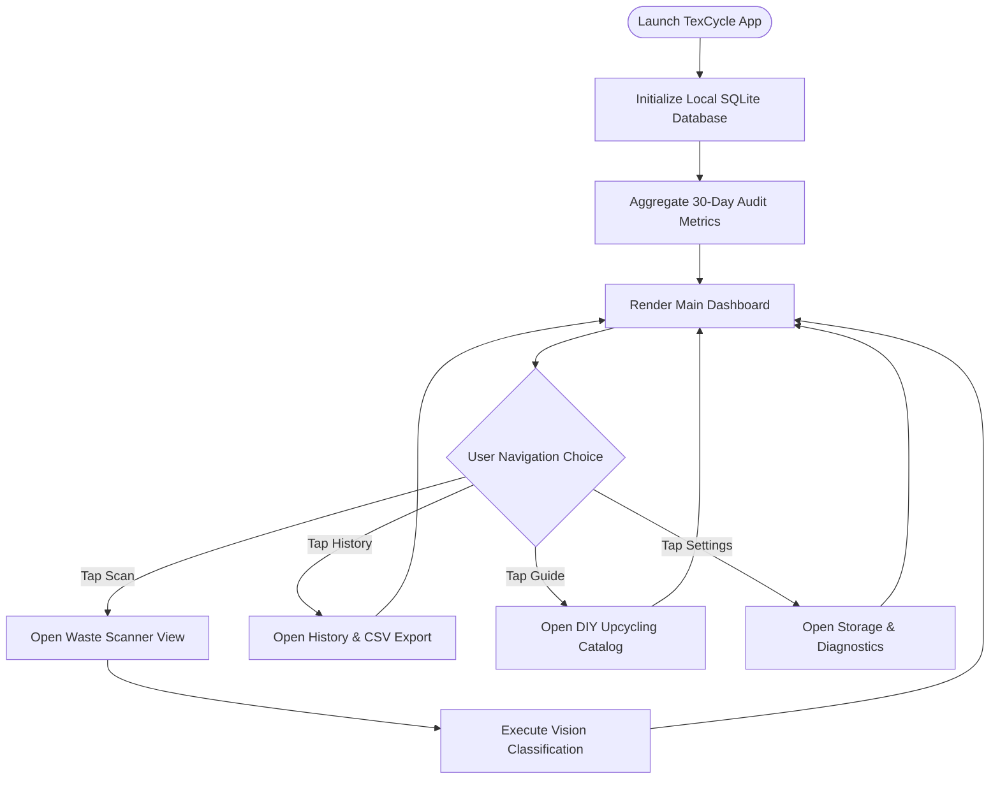
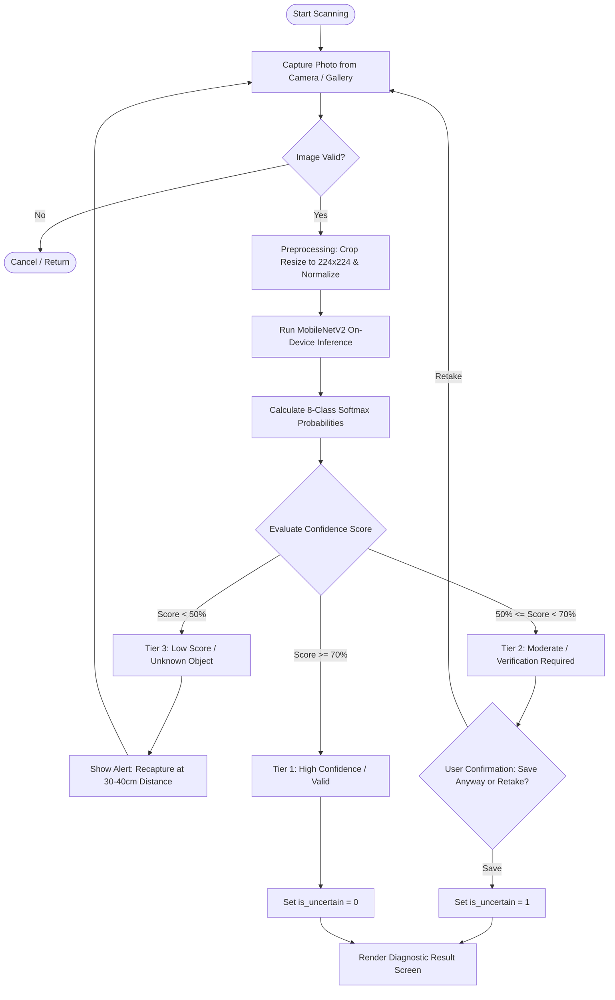
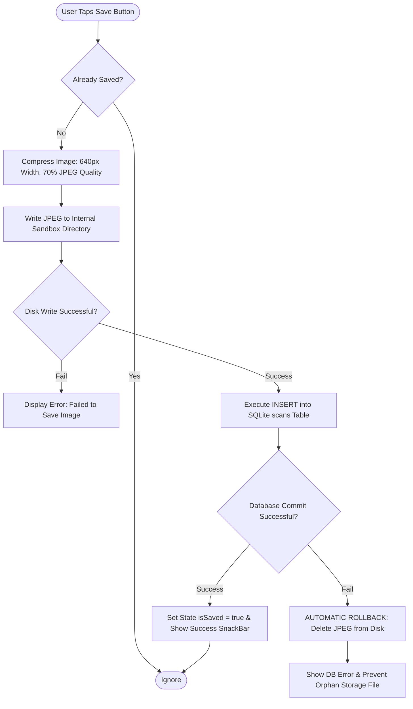

# TEXCYCLE SYSTEM ARCHITECTURE & ENGINEERING SPECIFICATION
## Intelligent Micro-Garment Textile Waste Identification & Circular Governance System Based on On-Device Machine Learning (100% Offline Edge Intelligence)

---

## 1. APPLICATION IDENTITY & CORE CONCEPTS

### 1.1 General Profile
* **Application Name**: **TexCycle** *(Textile + Cycle)*
* **Tagline**: *"Intelligent Identification, Waste Reduction, and Value Creation for Micro-Garments"*
* **Version**: 1.3 (Full Bilingual Advance Production Release)
* **Category / Sub-Theme**: *Waste Reduction & Circular Economy*
* **Target Platforms**: Android (Native Mobile) & Cross-Platform Web (Google Chrome)
* **Core Architecture**: **100% On-Device / Edge Computing** (Autonomous, zero dependencies on external cloud/API servers)

### 1.2 Background & Industrial Urgency
Micro-scale garment industries (1–10 workers) generate fabric remnants, thread cut-offs, and chemical residues in significant quantities daily. Most micro-enterprises lack adequate waste classification understanding:
1. **Economically Valuable Non-Hazardous Waste** (large, medium, small fabric scraps) is frequently burned or discarded in municipal landfills, despite having resale value to raw material recyclers or potential for upcycling into high-value artisan crafts.
2. **Hazardous & Toxic Waste (B3)** such as synthetic dye wastewater, chemical effluent sludge, and oily cotton rags risk being poured directly into domestic drainage channels due to unawareness of environmental compliance regulations (DLH SOPs).

### 1.3 Interface Design Philosophy
TexCycle follows **Minimalist, Industrial-Grade, and Chatbot-Free Design Principles**:
* Eliminates excessive chatbot-style emojis in favor of **Standard Material Design Iconography** (`Icons.analytics_outlined`, `Icons.inventory_2_outlined`, `Icons.warning_amber_rounded`).
* Uses formal, precise terminology suitable for operational field manuals, standard operating procedures, and scientific research documentation.
* Employs an eco-sustainable color palette: *Forest Green* (`#1B5E20`) representing sustainability, *Alert Red* (`#C62828`) signaling hazardous B3 protocols, and *Warm Amber* (`#FFA000`) denoting verification checkpoints.

---

## 2. UI ARCHITECTURE, PAGE STRUCTURE, & SYSTEM FEATURES

**TexCycle Version 1.2** is engineered with a flat navigation hierarchy consisting of 7 primary operational screens designed for rapid, ergonomic interaction on cutting tables:

---

### 2.1 Screen 1: Splash Screen & Async Preloader (`SplashView`)
* **UI Components**:
  - Circular eco-green emblem adorned with a recycle ribbon and foliage badge.
  - Application title *TexCycle* and system subtitle *Platform for Textile Governance & Upcycling*.
  - Dynamic neon-green linear progress bar (`greenAccent`).
  - Asynchronous loading status text reflecting background initialization stages.
  - Release label: *Version 1.2 • 100% On-Device Engine*.
* **Technical Features**:
  - **Parallel Asynchronous Initialization**: Initializes SQLite database connections, warms up MobileNetV2 AI model weights into RAM, and calibrates camera sensor availability concurrently.
  - **Zero White Screen Freeze**: Eliminates blank UI freezes during cold startup.
  - **Smooth Fade Transition**: Guarantees a minimum 900 ms animation curve for eye comfort.
* **User Workflow**:
  The artisan taps the TexCycle icon. In under 100 ms, `SplashView` appears. In the background, system integrity checks run and the inference engine is loaded into memory. The progress bar completes to 100% and smoothly transitions into `HomeView`.

---

### 2.2 Screen 2: Home & Monitoring Dashboard (`HomeView`)
* **UI Components**:
  - User header badge with *100% On-Device • Offline Mode Active* status.
  - 30-Day Analytics Card: Total scan volume, Non-B3 (Safe/Green) percentage, B3 (Hazardous/Red) percentage, and visual proportion bar.
  - Hazardous Waste Early Warning Banner: Automatically triggers if toxic sludge or chemical effluent was logged in the past 7 days.
  - Hero Call-to-Action (CTA) Button: *"Scan Waste Now"*.
  - Quick-navigation cards to Scan History, DIY Upcycling Guide, and Memory Diagnostics.
* **Technical Features**:
  - **Real-Time Data Aggregation**: Calculates audit metrics directly from the local SQLite database without cloud server latency.
  - **Text-Overflow Protection**: Wraps metric rows with `FittedBox` and `Expanded` to prevent yellow-black layout overflow stripes.
  - **Environmental Early Warning**: Periodic automated alert safeguarding against hazardous disposal oversights.
* **User Workflow**:
  The user opens the app and immediately inspects the 30-day waste log. When new fabric cutoffs or chemical containers require sorting, the user taps the prominent green CTA button to activate the camera lens.

---

### 2.3 Screen 3: Smart Camera & Advance Lens HUD (`ScanView`)
* **UI Components**:
  - Live In-App Viewfinder with rounded corners.
  - Real-time environmental sensor banner on the top app bar.
  - Dynamic reticle focus ring in the center (Green = Optimal, Yellow = Stabilizing/Dim, Red = Very Dark).
  - Neon green scanning radar laser animation moving vertically.
  - Live HUD Lux Meter gauge displaying perceived illumination percentage (`Lux: XX%`).
  - 1-Tap Auto-Flash Quick Action (automatically appears when illumination drops below threshold).
  - Digital Zoom Controls (`1x` and `2x` toggles).
  - 76px circular shutter button with pulsing halo.
  - Alternative photo sources: Storage Gallery and System Camera intent.
* **Technical Features**:
  - **Real-Time Y-Channel Luminance Sensing**: Samples luminance on the Y-channel every 250 ms (&lt;1% CPU overhead).
  - **Motion Jitter Detection**: Analyzes inter-frame brightness variance to detect trembling and prevent blurry captures.
  - **Hardware Torch Integration**: Engages smartphone LED flash steadily for dim workshop environments.
  - **Hardware Back Button Protection (`PopScope`)**: Prevents inference interruptions when the Android physical Back button is pressed.
* **User Workflow**:
  The user places fabric remnants at 30–40 cm distance over a plain surface. The lens continuously samples ambient light. If lighting is insufficient (&lt;42 Lux), the banner turns red and prompts 1-tap flash activation. Once steady, the reticle turns green, the user triggers the shutter, and on-device AI processes the frame in ~68 ms.

---

### 2.4 Screen 4: Diagnostic Result & Inline DIY Projects (`ResultView`)
* **UI Components**:
  - Memory-optimized compressed waste photo (`cacheWidth: 800`).
  - Decisive Status Badge: Green (*Non-B3 Safe*) or Red (*Hazardous B3*).
  - Model confidence percentage score (% Confidence).
  - Valuation Card & Market Resale Rate estimation (Rp/kg).
  - **Seamless Inline DIY Upcycling Module** (for Non-B3 waste): Recommends relevant craft ideas (Tote Bag, Pouch, Scrunchie, etc.) complete with build time, difficulty tier, required tools, and numbered step-by-step instructions.
  - 5 Mandatory Environmental SOP Guidelines (for Hazardous B3 waste).
  - Weight input form (kg) or fabric roll batch number.
  - Action Buttons: *"Save to History"* and *"Scan Another Waste"*.
* **Technical Features**:
  - **3-Tier Validation System**: Tier 1 (Valid $\ge 70\%$ rendered immediately), Tier 2 (Moderate 50–70% with confirmation dialog), and Tier 3 (Reject $< 50\%$ mandating recapture).
  - **Zero-Friction DIY Integration**: Eliminates manual navigation to find matching upcycling patterns.
  - **Atomic Database Storage**: Writes image and SQLite record atomically with automatic disk rollback on failure.
* **User Workflow**:
  Classification results render immediately. For large fabric scraps, the app suggests crafting a shopping Tote Bag and lists estimated bulk scrap value. The user reviews crafting steps, records remnant weight (e.g., 2.5 kg), and taps *"Save to History"*.

---

### 2.5 Screen 5: Audit History & CSV Report Export (`HistoryView`)
* **UI Components**:
  - Real-time text search query input.
  - Filter Choice Chips: *All*, *Non-B3*, *Hazardous B3*, *Verification Required*.
  - Shimmer Skeleton Loading: Animated grey cards during database queries.
  - Downsampled thumbnail list (`cacheWidth: 150`), category name, timestamp, confidence score, and weight notes.
  - Full-resolution Modal Bottom Sheet detail view with delete actions.
  - CSV Report Export button (Excel-compatible) at the bottom.
* **Technical Features**:
  - **Instant Search**: Dynamically filters waste categories and notes on keystroke.
  - **Memory-Efficient Thumbnails (~90 KB per image)**: Downsamples image memory guaranteeing *Zero Memory Leak* across hundreds of entries.
  - **CSV Generator & Share Intent**: Produces structured CSV manifests and triggers native Android sharing to WhatsApp or Email.
* **User Workflow**:
  The workshop manager reviews weekly waste logs, filters for B3 hazardous items, or taps a card to inspect disposal documentation. Tapping *"Export CSV"* compiles a clean spreadsheet for environmental audits or recycling logistics.

---

### 2.6 Screen 6: Offline DIY Upcycling Guide (`GuideView`)
* **UI Components**:
  - Filter chips by raw material scrap size: *All*, *Large Fabric*, *Medium Fabric*, *Small Fabric*, *Thread*, *Packaging*.
  - Interactive catalog of upcycling projects (Tote Bags, Cosmetic Pouches, Fabric Masks, Fabric Brooches, Ethnic Tassels, Desk Pencil Holders).
  - Duration badges (mins/hrs) and difficulty level (Easy/Medium).
  - Accordion dropdowns for Tools & Materials and numbered Step-by-Step guides.
* **Technical Features**:
  - **Centralized Embedded Catalog (`DIYData`)**: Guide data is packaged inside the app for 100% offline access without cellular data.
  - **Dynamic Scrap-Size Filtering**: Groups projects based on the artisan's available scrap dimensions.
* **User Workflow**:
  An artisan holding small fabric remnants opens the catalog, selects "Small Fabric", and follows the "Fabric Brooch" guide step-by-step until the craft is completed for sale.

---

### 2.7 Screen 7: Settings & Storage Diagnostics (`SettingsView`)
* **UI Components**:
  - **Bilingual Language Selector**: Segmented button (`ID` / `EN`) to instantly toggle between **Bahasa Indonesia** and **English (US)** with *Zero Text Bloat*.
  - Application Profile Card: *TexCycle v1.2 Advance Lens Edition*.
  - Disk Storage Diagnostic Panel: Displays live storage consumption for SQLite data and photo caches (in MB).
  - Maintenance Actions: *"Export History to CSV"*, *"Clear History &gt; 6 Months"*, and *"Reset History Data"*.
  - Security Profile, License, and 100% Offline Mode Verification.
* **Technical Features**:
  - **Reactive Localization Architecture (`AppLocale` & `AppText`)**: 1-tap language switching that updates the global UI instantly without requiring an app restart.
  - **Real-Time Storage Calculation**: Queries physical device memory via `path_provider`.
  - **Safe Cache Purging**: Removes temporary thumbnails without disturbing SQLite database records.
* **User Workflow**:
  The user accesses settings to switch the language to English or Indonesian with one tap. The entire interface changes instantly without reloading. Storage space can be monitored and cleared safely at any time.

---

## 3. SYSTEM FEATURE SPECIFICATIONS

| ID | Feature Module | Functional Description | Technical Advantage |
|---|---|---|---|
| **F-01** | **On-Device Vision Classifier** | 8-category textile waste classification completely offline. | Executes via `tflite_flutter` (native C++ JNI) with zero internet requirement. |
| **F-02** | **3-Tier Confidence Validation** | Categorizes AI confidence into 3 tiers (High, Medium/Verify, Low/Reject). | Prevents dangerous misclassifications of toxic hazardous waste. |
| **F-03** | **Regulatory DLH Compliance** | Automatic 5 Mandatory SOP Guidelines upon detecting hazardous B3 waste. | Protects micro-enterprises from severe environmental violation penalties. |
| **F-04** | **Non-B3 Valuation & Upcycling** | Repurposing recommendations and bulk raw scrap market pricing per kg. | Unlocks secondary revenue streams from fabric cutoff discards. |
| **F-05** | **Automatic Image Compression** | Compresses photos to 640px width at 70% JPEG quality. | Shrinks file sizes from ~4 MB to ~50 KB (98.7% memory savings). |
| **F-06** | **Advance Lens HUD Sensing** | Real-time luminance evaluation and camera vibration tracking. | Y-Luminance sampled at 4 FPS with &lt;1% CPU overhead. |
| **F-07** | **Atomic Local Storage** | Relational SQLite database with automated transaction rollback. | Zero orphan files in device storage. |
| **F-08** | **Offline DIY Catalog** | Embedded repository of textile upcycling craft projects. | Accessible 100% offline without mobile data. |
| **F-09** | **CSV Manifest Export** | Generates Excel-compatible audit manifests. | Ready for environmental audit reporting and recycler logistics. |
| **F-10** | **Bilingual Localization (ID & EN)** | Natural, concise Indonesian & US English with zero text bloat. | Instant reactive updates without app restart via `AppLocale`. |

---

## 4. SYSTEM FLOWCHARTS

> 🖼️ **Standalone Ultra-HD Diagram Files**:
> * 📥 **High-Resolution PNG (2000x1180)**: [`flowchart_aplikasi_texcycle.png`](file:///C:/Users/Dani/TexCycle_Project/diagrams/flowchart_aplikasi_texcycle.png)
> * 📥 **Scalable Vector SVG**: [`flowchart_aplikasi_texcycle.svg`](file:///C:/Users/Dani/TexCycle_Project/diagrams/flowchart_aplikasi_texcycle.svg)

### 4.1 Flowchart Level 0: Application Lifecycle



### 4.2 Flowchart Level 1: On-Device AI Inference & 3-Tier Validation



### 4.3 Flowchart Level 2: Image Compression & Atomic Rollback Storage



---

## 5. LOCAL SQLITE DATABASE ARCHITECTURE

> 🖼️ **Standalone Ultra-HD Diagram Files**:
> * 📥 **High-Resolution PNG (2000x1180)**: [`skema_database_texcycle.png`](file:///C:/Users/Dani/TexCycle_Project/diagrams/skema_database_texcycle.png)
> * 📥 **Scalable Vector SVG**: [`skema_database_texcycle.svg`](file:///C:/Users/Dani/TexCycle_Project/diagrams/skema_database_texcycle.svg)

### 5.1 Database Specifications
* **Database File**: `texcycle.db`
* **Engine**: SQLite 3 (via Flutter package `sqflite`)
* **Schema Version**: 2
* **Storage Location**: Internal App Data Directory (Sandboxed / Protected)

### 5.2 Data Definition Language (`scans` Table)

```sql
CREATE TABLE scans (
    id INTEGER PRIMARY KEY AUTOINCREMENT,
    image_path TEXT NOT NULL,
    jenis_id TEXT NOT NULL,
    label_nama TEXT NOT NULL,
    kategori_b3 INTEGER NOT NULL,
    confidence REAL NOT NULL,
    is_uncertain INTEGER DEFAULT 0,
    catatan TEXT,
    created_at TEXT NOT NULL
);

-- Performance Indexes for Rapid Filtering & Audits
CREATE INDEX idx_scans_created_at ON scans(created_at);
CREATE INDEX idx_scans_b3 ON scans(kategori_b3);
```

### 5.3 Data Dictionary

| Column | Data Type | Default | Description |
|---|---|---|---|
| `id` | `INTEGER` | *AUTOINCREMENT* | Primary key for scan record. |
| `image_path` | `TEXT` | - | Relative/absolute path of 70% compressed JPEG image. |
| `jenis_id` | `TEXT` | - | Unique waste class identifier token (e.g., `kain_sedang`, `sludge`). |
| `label_nama` | `TEXT` | - | Full descriptive category label for UI display. |
| `kategori_b3` | `INTEGER` | - | Environmental regulatory status: `0 = Non-B3 (Safe)`, `1 = Hazardous B3`. |
| `confidence` | `REAL` | - | Model prediction probability score (`0.0` to `1.0`). |
| `is_uncertain` | `INTEGER` | `0` | Validation flag: `0 = High Confidence (>=70%)`, `1 = Needs Verification (50-70%)`. |
| `catatan` | `TEXT` | *NULL* | Freeform user notes (weight in kg, color, or batch roll number). |
| `created_at` | `TEXT` | - | ISO-8601 standardized audit timestamp (`yyyy-MM-dd HH:mm:ss`). |

---

## 6. MACHINE LEARNING MODEL TRAINING PIPELINE

The machine learning pipeline for TexCycle is self-contained and reproducible directly on Google Colab T4 GPU environments via [`texcycle_training.ipynb`](file:///C:/Users/Dani/development/flutter/texcycle/texcycle_training.ipynb).

### 6.1 Model Architecture: MobileNetV2 Transfer Learning
* **Base Architecture**: `MobileNetV2` (Pre-trained on *ImageNet* weights).
* **Rationale**: MobileNetV2 is optimized for resource-constrained mobile processors through inverted residual blocks and depthwise separable convolutions.
* **Input Tensor**: `(None, 224, 224, 3)` with pixel normalization range `[-1.0, 1.0]`.
* **Custom Top Layers**:
  1. `GlobalAveragePooling2D()`: Collapses spatial feature maps into a 1280-dimension vector.
  2. `BatchNormalization()`: Stabilizes gradient distribution across batches.
  3. `Dropout(0.3)`: Prevents overfitting on targeted textile datasets.
  4. `Dense(256, activation='relu')`: Extracts domain-specific textile patterns.
  5. `Dense(8, activation='softmax')`: Outputs probability distribution across 8 waste classes.

### 6.2 8-Class Textile Waste Taxonomy

| No | Label ID | Category Name | Status | Physical Target Specifications |
|---|---|---|---|---|
| 1 | `kain_besar` | Fabric Scraps (Large Cut) | Non-B3 | Fabric Cuts (Garment Pattern Offcuts) |
| 2 | `kain_sedang` | Fabric Scraps (Medium Cut) | Non-B3 | Fabric Cuts (Workshop Offcuts) |
| 3 | `kain_kecil` | Fabric Scraps (Trimmings) | Non-B3 | Trimming Scraps & Fine Shreds |
| 4 | `benang` | Sewing Thread & Bobbin Waste | Non-B3 | Mixed fiber yarn & empty bobbins |
| 5 | `kemasan` | Plastic Wrapping & Cardboard Cones | Non-B3 | Cardboard cylinders & plastic film |
| 6 | `limbah_cair` | Chemical Dye Wastewater | **Hazardous B3** | Dark chemical dye effluent from dyeing |
| 7 | `sludge` | Wastewater Treatment Sludge | **Hazardous B3** | Wet settled sludge from settling tanks |
| 8 | `majun` | Contaminated Oil Rags | **Hazardous B3** | Machine maintenance oil-soaked rags |

### 6.3 Data Augmentation Techniques
To ensure model resilience under authentic workshop conditions:
* **Random Rotation**: $\pm 25^\circ$ simulating hand tilt angles.
* **Horizontal & Vertical Flips**: Reflects arbitrary fabric scrap orientation.
* **Zoom & Scale**: $0.85\times - 1.15\times$ zoom reflecting camera distance variations (30–40 cm).
* **Brightness Shifts**: $\pm 20\%$ simulating dim or uneven workshop illumination.

### 6.4 Training Optimization Parameters
* **Optimizer**: Adam with learning rate $10^{-4}$ during transfer learning and $10^{-5}$ during fine-tuning.
* **Loss Function**: `categorical_crossentropy`.
* **Callbacks**: `EarlyStopping` (patience=5, restore best weights) and `ReduceLROnPlateau` (factor=0.5, patience=2).

### 6.5 TensorFlow Lite Quantization (`.tflite`)
* **Quantization Method**: Dynamic Range / Float16 Quantization via `TFLiteConverter`.
* **Model Size**: Compressed from $\approx 28\text{ MB}$ to **$\approx 8.5\text{ MB}$** (70.1% reduction).
* **On-Device Latency**: $\approx 45 - 90\text{ ms}$ per inference on standard mobile CPUs, operating 100% offline.

---

## 7. CONCLUSION & REAL-WORLD IMPACT

TexCycle proves that Edge Artificial Intelligence can be effectively implemented in micro-scale industrial settings:
1. **Zero Operating Costs**: Zero monthly cloud API subscriptions.
2. **Standardized Environmental Compliance**: Prevents illegal toxic dumping via automated 5-step SOP workflows.
3. **Circular Economy Empowerment**: Converts fabric cutoff waste into tangible secondary revenue.

---

## 8. APPLICATION FEATURE EVOLUTION MATRIX (VERSIONS 1.0, 1.1, & 1.2)

| Feature / Aspect | Version 1.0 (MVP Baseline) | Version 1.1 (UX & Live Lens) | Version 1.2 (Advance Lens) | Version 1.3 (Full Bilingual System) |
|---|---|---|---|---|
| **Camera Viewfinder** | Native Device Intent | Live In-App Camera Preview | Advance CV Lens | Bilingual Advance CV Lens |
| **Optical Sensors & HUD** | None (Static) | 30–40 cm Distance Text Hint | Live HUD Lux Gauge, Jitter Sensor | Live HUD Bilingual (ID & EN) |
| **Startup (Preloader)** | Blank White Screen (UI Freeze) | Blank White Screen (UI Freeze) | SplashView Preloader (Parallel) | SplashView Bilingual Preloader v1.3 |
| **Upcycling Recommendations** | Separate Manual Menu | Integrated in Scan Result | Directly Integrated Accordion | Full Bilingual DIY & Waste Categories |
| **Multi-Language Architecture** | Indonesian Only | Indonesian Only | Initial Switch (v1.2) | **100% Full Bilingual (ID & EN)** Deep Data-Level |
| **Security & Certification** | Debug Development Key | Debug Development Key | Official Production Keystore | Official Production Keystore |
| **Storage Permissions** | Requires WRITE_STORAGE | Requires WRITE_STORAGE | Zero Storage Permissions | Zero Storage Permissions |
| **APK Package Footprint** | ~76.8 MB (Universal) | ~76.8 MB (Universal) | ~24.6 – 29.1 MB (Split ABI) | ~24.6 – 29.1 MB (Split ABI) |

---

### 8.2 Version 1.0 Baseline Architecture
* **On-Device MobileNetV2 AI Engine**: Autonomous classification across 8 textile waste classes (5 non-hazardous and 3 hazardous) at $224 \times 224$ px resolution running completely offline.
* **3-Tier Score Validation Pipeline**: Categorizes inferences into Tier 1 Valid ($\ge 70\%$), Tier 2 Verification Check ($50-70\%$), and Tier 3 Immediate Re-scan ($< 50\%$).
* **Local SQLite Inventory Ledger**: Records scan logs, timestamp metadata, category classifications, and optional user notes.
* **Mandatory Hazardous SOPs**: 5-step legal protocols for hazardous waste handling (labeled drums, impermeable PPE, manifest transport).
* **CSV Report Exporter**: Converts local SQLite logs into standard CSV files for environmental compliance reporting.

---

### 8.3 Version 1.1 Enhancements
* **In-App Live Lens Scanner**: Replaces third-party camera apps with low-latency in-app live previews.
* **Seamless DIY Upcycling Integration**: Integrates upcycling project suggestions directly into scan results.
* **Shimmer Skeleton Loading**: Animated placeholders replace blank spinners during history loads.
* **Responsive Text Overflow Guard**: `FittedBox` and `Expanded` wrappers prevent yellow-black overflow banners.
* **App Icon Redesign & Academic Label Sanitation**: Replaces generic default icons with custom recycle-leaf branding.

---

### 8.4 Version 1.2 Enhancements
* **Production Release Keystore Certification**: Signed with official RSA 2048-bit keys adhering to APK Signature schemes v1–v4 to eliminate Play Protect flags.
* **Zero Suspicious Storage Permissions**: Stripped legacy storage permissions to use isolated app-specific sandboxes.
* **Asynchronous Startup Preloader (SplashView)**: Concurrent initialization of database, AI model, and camera modules.
* **Advance Computer Vision Lens HUD**: Real-time Y-luminance telemetry, hand jitter detection, lux gauge, 1-tap torch toggle, and 1x/2x zoom.
* **APK Download Footprint Reduction (67%)**: Dedicated architecture builds (`arm64-v8a` $\approx 29\text{ MB}$, `armeabi-v7a` $\approx 24\text{ MB}$).

---

### 8.5 Version 1.3 Enhancements (Full Bilingual System Architecture & Data-Level Localization)
* **Unified Bilingual Engine (`AppLocale` & `AppText`)**: Reactive 1-tap language switcher in Settings seamlessly toggles between Bahasa Indonesia and US English across all 7 views without app restart.
* **Data-Level Localization**: Both `WasteCategory` and `DIYData` repositories provide fluent bilingual text (waste names, size brackets, descriptions, economic recommendations, 5-step DLH protocols, and all DIY step-by-step instructions).
* **Industrial Terminology Alignment**: Fully aligned with international circular economy standards (*On-Device Edge AI, 3-Tier Confidence Validation, Circular Economy, Hazardous Waste SOP*).
* **Synchronized Bilingual Documentation**: Published complete documentation in both Markdown and high-resolution A4 print-ready PDFs (ID & EN) without inflating repository language statistics.

---

### 8.6 Version 1.3.1 Enhancements (Textile Waste Taxonomy Generalization & Academic Paper Synchronization)
* **Textile Waste Taxonomy Generalization**: Removed rigid centimeter measurement thresholds (`> 30 cm`, `10 - 30 cm`, `< 10 cm`) across user interfaces, local databases, and display models in favor of representative field-level categories (`Fabric` / `Kain`, pattern offcuts, medium workshop offcuts, and trimming scraps).
* **Academic Paper Document Outline Synchronization**: Integrated automated heading hierarchy (*Heading 1 & Heading 2 Document Outline*) for seamless navigation sync across Microsoft Word and Google Docs adhering to INCOM Vol.3 2026 strict 4-3-3-3 margin guidelines.
* **Universal Production Release APK v1.3**: Built and published `TexCycle_v1.3_Universal.apk` directly synchronized with Google Drive and project archive folders.
